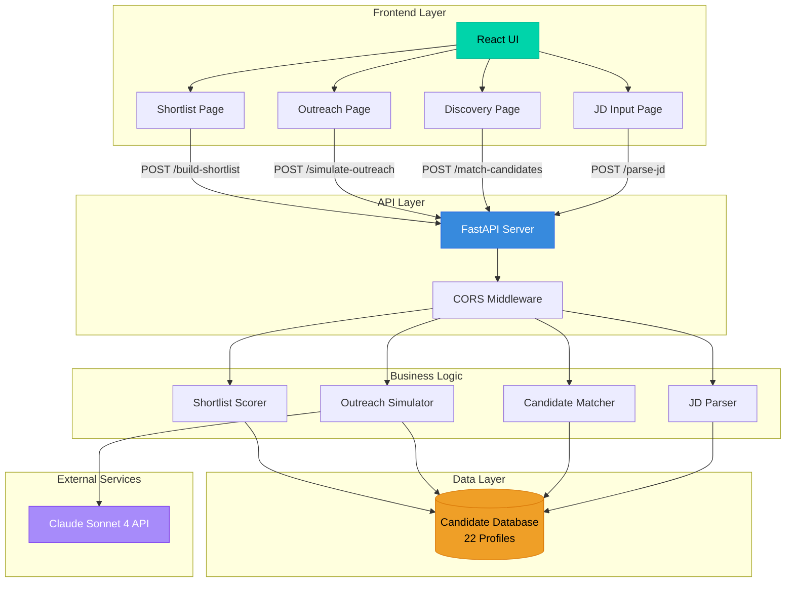
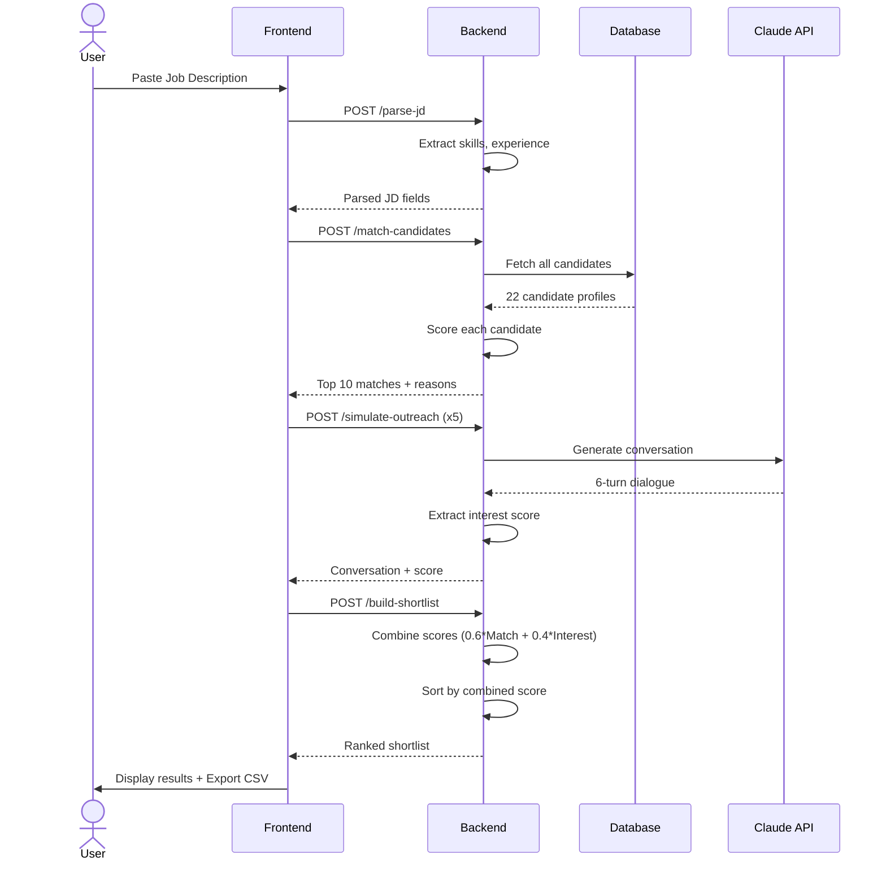
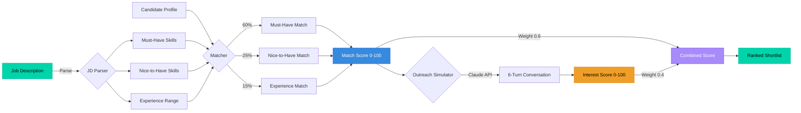

# ScoutAI Architecture

## System Architecture Diagram

```mermaid
graph TB
    subgraph "Frontend Layer"
        UI[React UI]
        JD[JD Input Page]
        DISC[Discovery Page]
        OUT[Outreach Page]
        SHORT[Shortlist Page]
    end
    
    subgraph "API Layer"
        API[FastAPI Server]
        CORS[CORS Middleware]
    end
    
    subgraph "Business Logic"
        PARSER[JD Parser]
        MATCHER[Candidate Matcher]
        OUTREACH[Outreach Simulator]
        SCORER[Shortlist Scorer]
    end
    
    subgraph "Data Layer"
        DB[(Candidate Database<br/>22 Profiles)]
    end
    
    subgraph "External Services"
        CLAUDE[Claude Sonnet 4 API]
    end
    
    UI --> JD
    UI --> DISC
    UI --> OUT
    UI --> SHORT
    
    JD -->|POST /parse-jd| API
    DISC -->|POST /match-candidates| API
    OUT -->|POST /simulate-outreach| API
    SHORT -->|POST /build-shortlist| API
    
    API --> CORS
    CORS --> PARSER
    CORS --> MATCHER
    CORS --> OUTREACH
    CORS --> SCORER
    
    PARSER --> DB
    MATCHER --> DB
    OUTREACH --> CLAUDE
    OUTREACH --> DB
    SCORER --> DB
    
    style UI fill:#00d4aa,stroke:#00b894,color:#000
    style API fill:#378add,stroke:#2563eb,color:#fff
    style CLAUDE fill:#a78bfa,stroke:#7c3aed,color:#fff
    style DB fill:#ef9f27,stroke:#d97706,color:#000
```

## Data Flow

```mermaid
sequenceDiagram
    actor User
    participant Frontend
    participant Backend
    participant Database
    participant Claude API
    
    User->>Frontend: Paste Job Description
    Frontend->>Backend: POST /parse-jd
    Backend->>Backend: Extract skills, experience
    Backend-->>Frontend: Parsed JD fields
    
    Frontend->>Backend: POST /match-candidates
    Backend->>Database: Fetch all candidates
    Database-->>Backend: 22 candidate profiles
    Backend->>Backend: Score each candidate
    Backend-->>Frontend: Top 10 matches + reasons
    
    Frontend->>Backend: POST /simulate-outreach (x5)
    Backend->>Claude API: Generate conversation
    Claude API-->>Backend: 6-turn dialogue
    Backend->>Backend: Extract interest score
    Backend-->>Frontend: Conversation + score
    
    Frontend->>Backend: POST /build-shortlist
    Backend->>Backend: Combine scores (0.6*Match + 0.4*Interest)
    Backend->>Backend: Sort by combined score
    Backend-->>Frontend: Ranked shortlist
    
    Frontend->>User: Display results + Export CSV
```

## Scoring Pipeline

```mermaid
flowchart LR
    A[Job Description] -->|Parse| B{JD Parser}
    B --> C[Must-Have Skills]
    B --> D[Nice-to-Have Skills]
    B --> E[Experience Range]
    
    F[Candidate Profile] --> G{Matcher}
    C --> G
    D --> G
    E --> G
    
    G -->|60%| H[Must-Have Match]
    G -->|25%| I[Nice-to-Have Match]
    G -->|15%| J[Experience Match]
    
    H --> K[Match Score 0-100]
    I --> K
    J --> K
    
    K --> L{Outreach Simulator}
    L -->|Claude API| M[6-Turn Conversation]
    M --> N[Interest Score 0-100]
    
    K -->|Weight 0.6| O[Combined Score]
    N -->|Weight 0.4| O
    
    O --> P[Ranked Shortlist]
    
    style A fill:#00d4aa,stroke:#00b894,color:#000
    style K fill:#378add,stroke:#2563eb,color:#fff
    style N fill:#ef9f27,stroke:#d97706,color:#000
    style O fill:#a78bfa,stroke:#7c3aed,color:#fff
    style P fill:#00d4aa,stroke:#00b894,color:#000
```
